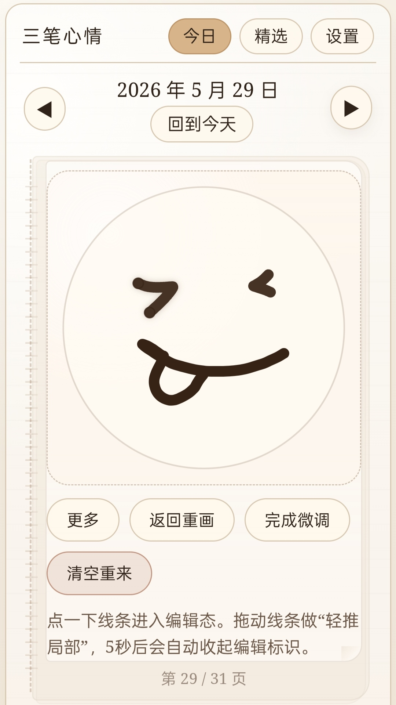
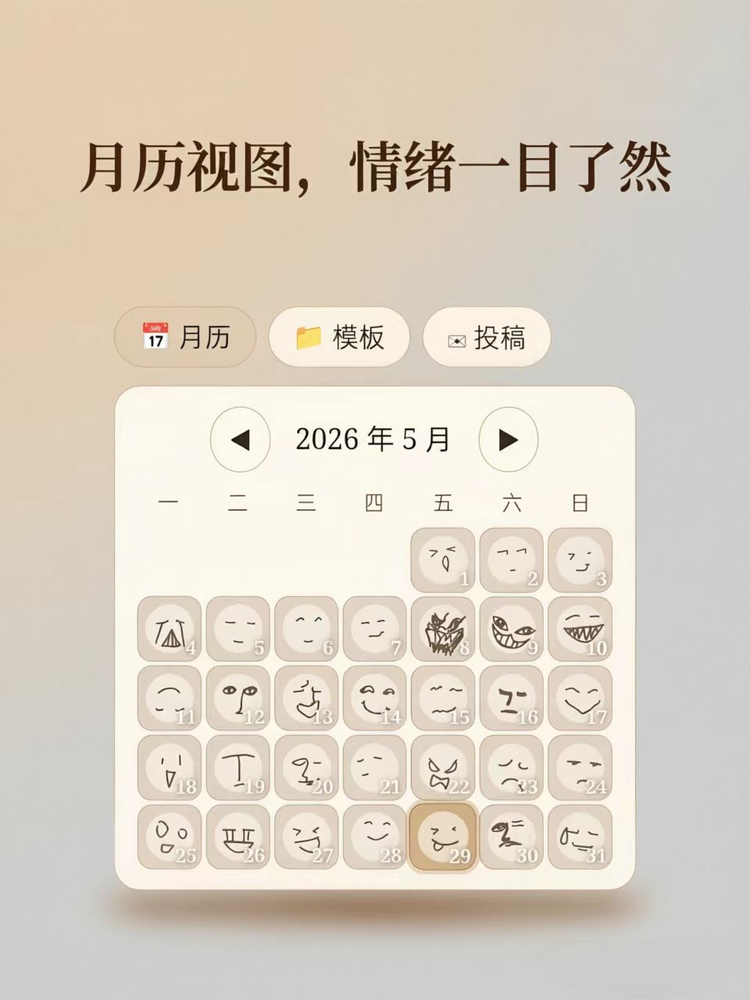
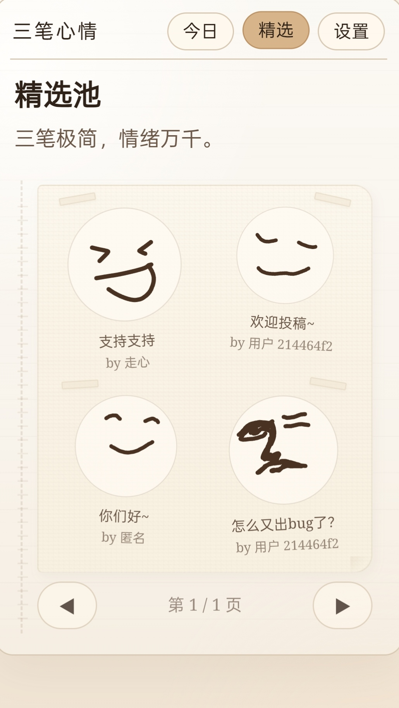

<p align="center">
  <picture>
    
  </picture>
</p>

<h1 align="center">三笔心情 · Mood Strokes</h1>

<p align="center">
  <strong>三笔极简，情绪万千。</strong><br />
  一款极简的心情日历 PWA 📅。
</p>

<p align="center">
  <a href="https://mood-strokes.pages.dev" target="_blank">
    
  </a>
  
  
  
  
</p>

---

## 💡 灵感起点

作者在日常书写记录时喜欢用简笔画表达此刻心情，通常是三笔：两个弓形圆弧是微笑的眼睛，向上弯的弧形是微笑的嘴巴。将三笔倒置就成了难过。通过控制这些弧度，会产生其他微妙复杂的表情……这就是三笔心情的起点：**用最少的笔触，捕捉最微妙的心绪。**

## 🎨 设计哲学

情绪是复杂的，仅靠文字表述（开心、难过、愤怒...）存在语义局限。项目通过**直觉绘制 + 语义微调**，实现对情绪记录的扩展，发挥"大道至简"的作用。画完后你可以手动微调，也可以像说话一样调整表情：

> "嘴角再上扬一点"
> "眼尾挑起来一些"

最终呈现的不是像素级的精准，而是**笔触的温度**。每记录一条，像日历本翻过一页，方便回顾过去的心境。

## ✨ 功能亮点

- 🖌️ **三笔绘制** — 自由笔触 + 语义微调（嘴角上扬、眼尾挑、松紧等），画板置顶，打开即画
- 📅 **热力图月历** — 折叠式热力图，有记录的日期格子内展示微型表情缩略图，直观看见情绪色彩
- 📖 **翻本子动画** — 画板和精选页均实现 3D 翻页效果，装订线 + 叠层纸 + 卷页阴影，模拟手工线圈本
- 🔐 **OTP 验证码登录** — 邮箱接收验证码，当前浏览器直接输入，无需跳转。安全合并 / 本地覆盖云端 / 云端覆盖本地三种同步模式
- 📤 **投稿与精选审核** — 匿名投稿，管理员审核（入选/驳回），展示作者昵称 + 邮箱，本小时限投 10 次并显示剩余额度
- 🖼️ **精选挂历** — 每页 4 个表情，大小错落 + 和纸胶带粘贴 + 四种排版轮换，纸纤维纹理背景
- 📲 **分享图生成** — 表情 + 文案 + 二维码合成为 3:4 手机比例分享图，支持系统分享或保存本地
- 📱 **PWA 就绪** — 可安装到桌面（autoUpdate 模式），完全离线使用，新版本自动更新

## 📸 界面预览

<p align="center">
  
  
  
  
</p>

## 🗂 项目结构

```
src/
├── components/
│   ├── ErrorBoundary.tsx          # 崩溃兜底
│   ├── HeatmapCalendar.tsx        # 热力图月历
│   ├── MoodFaceSvg.tsx            # 表情 SVG 渲染器
│   ├── ShareDialog.tsx            # 分享图预览
│   └── ThreeStrokeMoodEditor.tsx  # 三笔编辑器（绘制+微调两阶段）
├── hooks/
│   ├── useAuth.ts                 # 认证 + 同步 + 昵称
│   └── useCuration.ts             # 精选 + 审核 + 投稿
├── lib/
│   ├── storage.ts                 # localStorage CRUD + 缓存 + 结构校验
│   ├── cloudSync.ts               # Supabase 认证 + OTP + 同步
│   ├── curation.ts                # 投稿 + 审核 + 精选查询
│   ├── strokeAdjust.ts            # 笔触微调引擎（nudge/eye/mouth/tension）
│   ├── shareImage.ts              # Canvas 合成分享图
│   ├── presets.ts                 # 预设表情模板
│   ├── date.ts                    # 日期工具
│   └── supabase.ts                # Supabase 客户端
├── pages/
│   ├── TodayPage.tsx              # 今日：热力图 + 画板书本 + 备注保存
│   ├── FeaturedPage.tsx           # 精选：4 表情挂历翻页 + 纸纹理
│   └── SettingsPage.tsx           # 设置：分组卡片 + 同步条 + 审核
├── types/
│   ├── mood.ts                    # MoodFace / MoodEntry 类型
│   └── curation.ts                # Submission / Template 类型
├── App.tsx                        # 根组件：3-tab 路由
├── App.css                        # 全部样式
└── index.css                      # CSS 变量
supabase/
└── schema.sql                     # 完整数据库定义（表/RLS/触发器/RPC）
```

## 🚀 本地部署

```bash
npm install
cp .env.example .env   # 填入 Supabase URL + anon key
npm run dev
```

```bash
npm run lint           # ESLint
npm run test:run       # Vitest（39 个用例）
npm run build          # tsc + vite 生产构建
npm run security:scan  # 敏感信息扫描
```

Supabase 初始化：在 SQL Editor 执行 `supabase/schema.sql`

---

> ✨ 这是一个 Vibe Coding 实验项目。欢迎使用与交流：
> - GitHub Issues
> - 邮箱：zouxinpangbai@qq.com

◍ Happy vibing 😊
