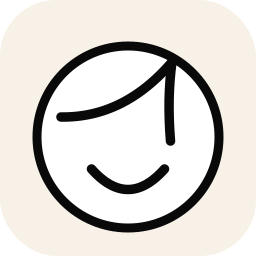
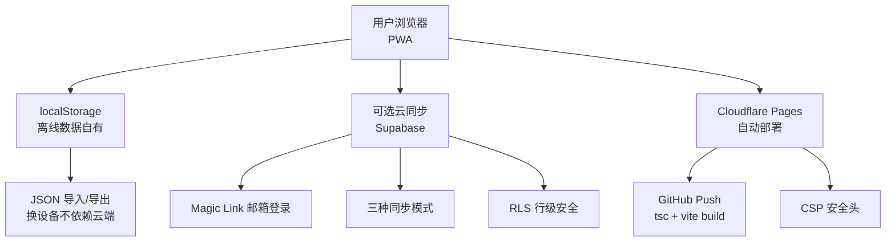

  <picture>
    
  </picture>

<h1 align="center">三笔心情 · Mood Strokes</h1>

  <strong>三笔极简，情绪万千。</strong> 
  一款极简的心情日历 Web App 📅。 

  
  
  
  
  

---

## 💡 灵感起点

 作者在日常书写记录时喜欢用简笔画表达此刻心情，通常是三笔：两个弓形圆弧是微笑的眼睛，向上弯的弧形是微笑的嘴巴。将三笔倒置就成了难过。
 通过控制这些弧度，会产生其他微妙复杂的表情……
 这就是三笔心情的起点：**用最少的笔触，捕捉最微妙的心绪。**

## 🎨 设计哲学。

情绪是复杂的，仅靠文字表述（开心、难过、愤怒...）存在语义局限，项目通过**直觉绘制 + 语义微调**，实现对情绪记录的扩展，发挥“大道至简”的作用。  
通过简单的三笔绘画后，你可以手动微调，也可以像说话一样调整表情：

> “嘴角再上扬一点”  
> “眼尾挑起来一些”  

最终呈现的不是像素级的精准，而是**笔触的温度**。  
每记录一条，像日历本翻过一页，方便回顾过去的心境。

## ✨ 功能亮点

- 🖌️ **三笔绘制** — 自由笔触，创建个人的微情绪记录库
- 🎛️ **语义微调滑块** — “嘴角上扬”“眼尾下垂”，一键式微调表情
- 📅 **热力图月历** — 折叠式热力图，直观看见这个月的情绪色彩
- ☁️ **可选云同步** — Supabase Magic Link 免密登录，支持账户内容云端同步，RLS 行级安全
- 📤 **投稿 & 精选** — 投稿你的表情，审核通过后可入选社区精选挂历
- 📱 **PWA 就绪** — 可安装到桌面，完全离线使用

## 🧱 架构总览

> ✨ 这是一个 Vibe Coding 实验项目。  
> 欢迎使用与交流：  
>• GitHub Issues
>• 邮箱：zouxinpangbai@qq.com 

◍ Happy vibing 😊
